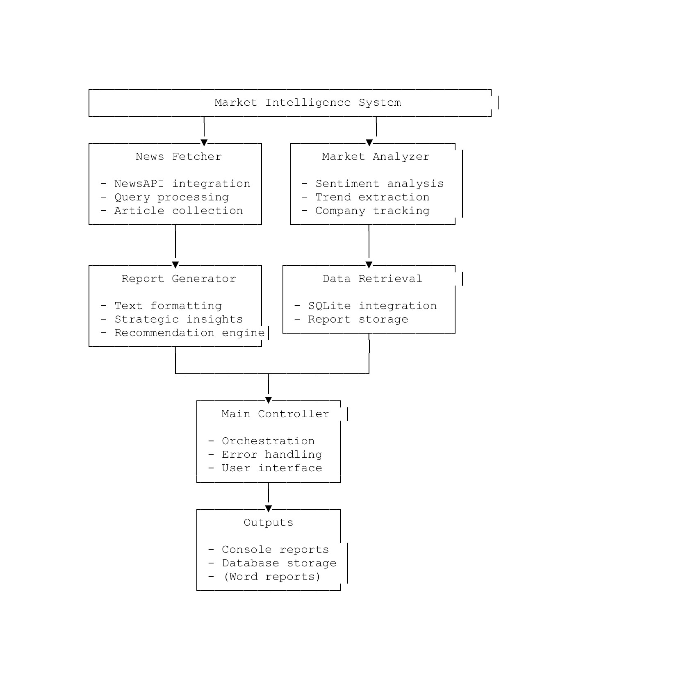

# Autonomous Industry Intelligence Report Generator

This project is an end-to-end system that **autonomously generates market intelligence reports** based on a high-level query. It automates the full pipeline of research, analysis, and report writing using prompt-engineered LLMs and modular architecture.

---

## Project Overview

Business leaders rely on regular industry insights for strategic decisions. Traditionally, these reports require extensive manual effort to:

- Research market trends and key players
- Analyze data and sentiments
- Draft comprehensive business reports

This system solves that with **zero-shot AI, intelligent modular components, and an efficient, scalable pipeline**.

---

## Features

- **Zero-shot prompting**: Uses LLMs with engineered prompts to perform tasks without fine-tuning.
- **Dynamic data scraping**: Gathers up-to-date content from reliable sources.
- **NLP-driven analysis**: Performs sentiment analysis, topic modeling, and competitor analysis.
- **Structured report generation**: Automatically formats output into readable Word or Markdown documents.
- **Data caching layer**: Separates data retrieval from analysis to improve performance and reuse data.

---

## System Architecture

The system is composed of modular components that communicate in sequence to deliver a fully autonomous pipeline. Here's a high-level architecture diagram:

  

### Components:
1. **Prompt Engine**: Converts high-level user input into specialized prompts for different tasks.
2. **Web Scraper**: Retrieves real-time industry data (news, articles, etc.).
3. **Cache / Database**: Stores documents locally to avoid repeated scraping.
4. **Analyzer**:
   - Topic modeling
   - Sentiment extraction
   - Named entity recognition (companies, products)
5. **Competitor Extractor**: Identifies and ranks key players.
6. **Report Generator**: Builds a structured, multi-section report using AI models.

This design enables **scalability**, **maintainability**, and **minimal reprocessing overhead** by separating document retrieval and AI-powered analysis.

## Sample Output

  

